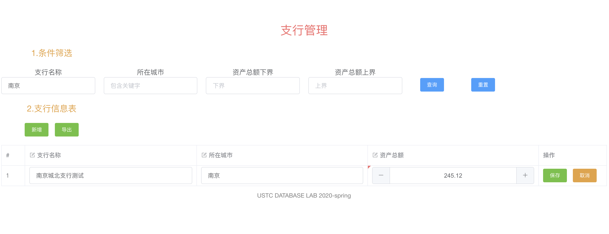
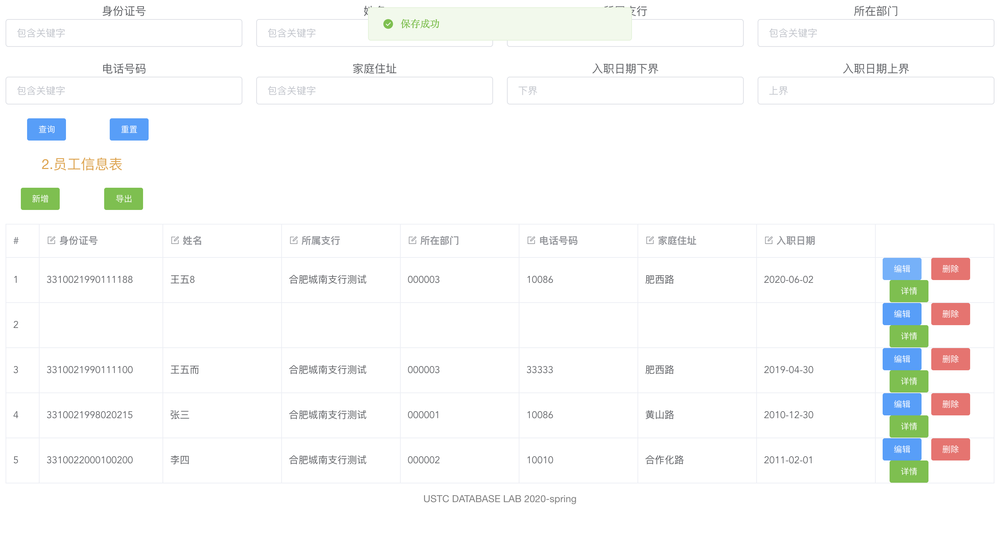
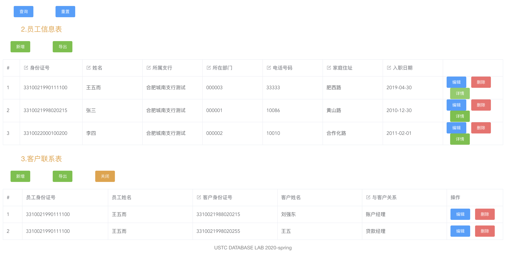
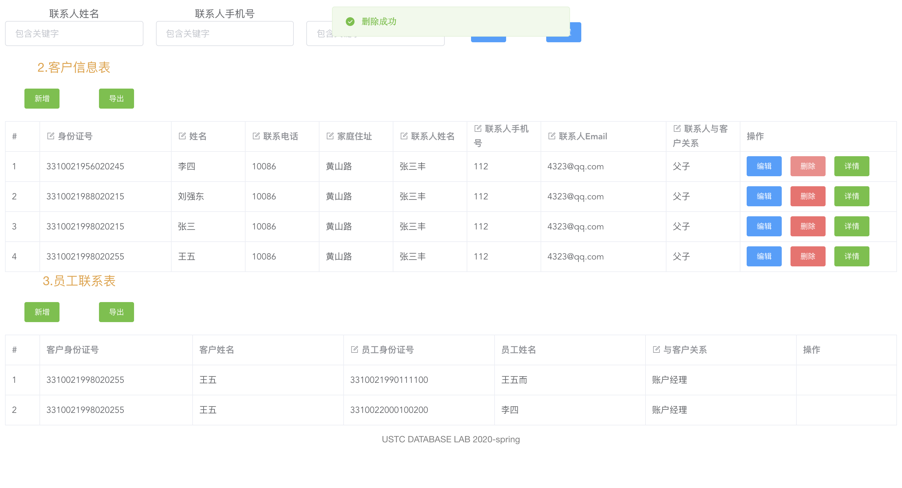
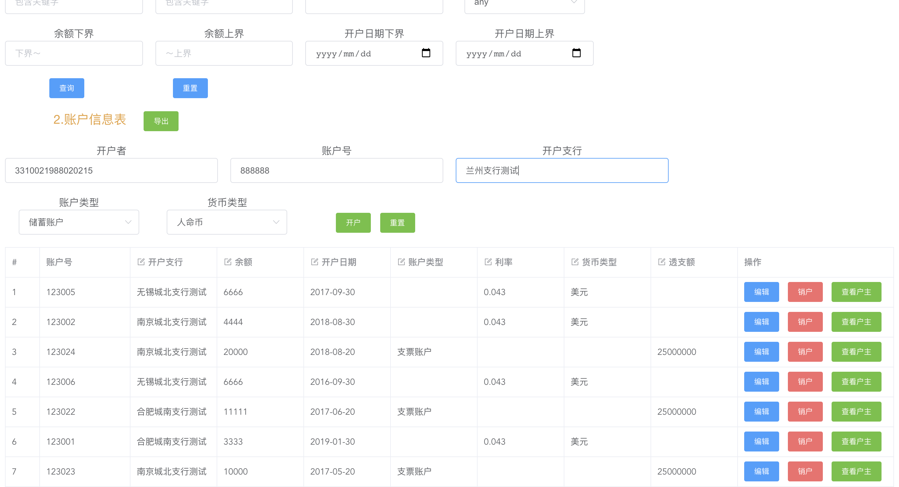

<center>目录</center>
===
---

[toc]

---

## 1 概述
### 1.1 系统目标
构建一个B/S结构的银行业务管理系统，实现系统的前端页面、后台服务器和数据库的设计构建，最终系统运行结果 达到功能完整简洁流畅，数据库操作安全规范，界面美观友好，满足银行业务管理的实际需求，保证数据的一致性， 具有较强的鲁棒性和可用性。

### 1.2 需求说明
#### 1.2.1 数据需求
>银行有多个支行。各个支行位于某个城市，每个支行有唯一的名字。银行要监控每个支行的 资产。 银行的客户通过其身份证号来标识。银行存储每个客户的姓名、联系电话以及家庭 住址。为了安全起见，银行还要求客户提供一位联系人的信息，包括联系人姓名、手机号、 Email 以及与客户的关系。客户可以有帐户，并且可以贷款。客户可能和某个银行员工发生 联系，该员工是此客户的贷款负责人或银行帐户负责人。银行员工也通过身份证号来标识。 员工分为部门经理和普通员工，每个部门经理都负责领导其所在部门的员工，并且每个员工 只允许在一个部门内工作。每个支行的管理机构存储每个员工的姓名、电话号码、家庭地 址、所在的部门号、部门名称、部门类型及部门经理的身份证号。银行还需知道每个员工开 始工作的日期，由此日期可以推知员工的雇佣期。银行提供两类帐户——储蓄帐户和支票帐 户。帐户可以由多个客户所共有，一个客户也可开设多个账户，但在一个支行内最多只能开 设一个储蓄账户和一个支票账户。每个帐户被赋以唯一的帐户号。银行记录每个帐户的余 额、开户日期、开户的支行名以及每个帐户所有者访问该帐户的最近日期。另外，每个储蓄 帐户有利率和货币类型，且每个支票帐户有透支额。每笔贷款由某个分支机构发放，能被一 个或多个客户所共有。每笔贷款用唯一的贷款号标识。银行需要知道每笔贷款所贷金额以及 逐次支付的情况(银行将贷款分几次付给客户)。虽然贷款号不能唯一标识银行所有为贷款 所付的款项，但可以唯一标识为某贷款所付的款项。对每次的付款需要记录日期和金额。

#### 1.2.2 主要功能需求
- 支行管理: 提供支行所有信息的增、删、改、查功能; 如果支行存在着关联信息，如员工、账户等，则不允 许删除
- 员工管理: 提供支行员工所有信息的增、删、改、查功能; 如果员工存在着关联数据，则不允许删除
- 客户管理: 提供客户所有信息的增、删、改、查功能; 如果客户存在着关联账户或者贷款记录，则不允许删除
- 账户管理: 提供账户开户、销户、修改、查询功能，包括储蓄账户和支票账户; 账户号不允许修改
- 贷款管理: 提供贷款信息的增、删、查功能，提供贷款发放功能; 贷款信息一旦添加成功后不允许修改; 要求能查询每笔贷款的当前状态(未开始发放、发放中、已全部发放); 处于发放中状态的贷款记录不允许删除
- 业务统计: 按业务分类(储蓄、贷款)和时间(月、季、年)统计各个支行的业务总金额和用户数(选做: 对统计结果以饼图或曲线图显示)

### 1.3 本报告主要贡献
- 提供了银行业务管理系统各项功能需求的解决方案
- 提供了满足需求、设计合理的数据库设计方案
- 给出了清晰明了的前后端功能结构设计和模块关系
- 详细说明了前后端各个功能模块的具体设计
- 给出了系统最终的测试结果展示
- 为系统的使用和开发提供了参考

## 2 总体设计
### 2.1 系统模块结构
```shell
.
├── README.md
├── backend
│   ├── __pycache__/
│   ├── account.py
│   ├── bank.py
│   ├── customer.py
│   ├── img
│   ├── loan.py
│   ├── login.py
│   ├── register.py
│   ├── staff.py
│   ├── summary.py
│   └── try.py
├── build/
├── config/
├── index.html
├── package-lock.json
├── package.json
├── src
│   ├── App.vue
│   ├── assets
│   │   └── logo.png
│   ├── components
│   │   └── HelloWorld.vue
│   ├── main.js
│   ├── router
│   │   └── index.js
│   └── views
│       ├── Account.vue
│       ├── Bank.vue
│       ├── Customer.vue
│       ├── Error.vue
│       ├── Index.vue
│       ├── Loan.vue
│       ├── Login.vue
│       ├── Register.vue
│       ├── Staff.vue
│       └── Summary.vue
├── static
│   ├── 404.png
│   └── 4042.jpg
└── test/

```

### 2.2 系统工作流程
>前后端通过HTTP Request/Response进行数据交互，每一部分的模块设计相互对应；前端将后端数据的页面反馈给用户；后端与Mysql数据库通过pymysql进行数据查询，数据增加，数据删除和数据更改。


### 2.3 数据库设计
#### 2.3.0 
**E-R模型设计**


**逻辑数据结构**


**最终物理数据库结构**
```sql
# 0.删除旧表
Set Foreign_Key_Checks = 0; 
Drop table if exists Sub_bank; 
Drop table if exists Employee; 
Drop table if exists Customer; 
Drop table if exists Check_account; 
Drop table if exists Deposit_account; 
Drop table if exists Loan; 
Drop table if exists Pay; 
Drop table if exists Customer_Deposit_account; 
Drop table if exists Customer_Check_account; 
Drop table if exists Loan_Customer; 
Drop table if exists Employee_Customer; 
Set Foreign_Key_Checks = 0; 

# 1.建立支行表
Create Table Sub_bank(
    Bank_name	Char(50), 
    City		Char(50), 
    Possession	Float	Default 0.0, 
    Bank_pass	Char(6)	Default '123456', 
    Constraint PK_Bank Primary Key (Bank_name)
);
# 2.建立员工表
Create Table Employee(
    Employee_id			BIGInt(16), 
    Employee_depart_id	Char(10), 
    Employee_bank_name	Char(32), 
    Employee_name		Char(50), 
    Employee_phone		Int(12), 
    Employee_address	Char(128), 
    Employee_enterdate		Date, 
    Employee_lead		Char(10), 
    Employee_password	Char(6)	Default '123456',
    Constraint PK_Employee Primary Key (Employee_id), 
    Constraint UQ_Leader Unique (Employee_lead)
);
# 3.建立客户表
Create Table Customer(
    Customer_id			BigInt(16), 
    Customer_name		Char(32), 
    Customer_phone		Int(12), 
    Customer_address	Char(128), 
    Customer_contact_name	Char(32), 
    Customer_contact_phone	Int(12), 
    Customer_contact_email	Char(64), 
    Customer_contact_relation	Char(32), 
    Customer_pass	Char(6),
    Constraint PK_Customer Primary Key (Customer_id)
);
# 4.建立支票账户表
Create Table Check_account(\
    Check_account_id		Int(16), 
    Check_account_money		Float, 
    Check_account_regdate	Date, 
    Check_account_overdraft	Float, 
    Check_account_password	Char(6)	Default '123456', 
    Constraint PK_Check_account	Primary Key	(Check_account_id)
);
# 5.建立存储账户表
Create Table Deposit_account(
    Deposit_account_id		Int(16), 
    Deposit_account_money	Float, 
    Deposit_account_regdate	Date, 
    Deposit_account_interestrate Float	Default 0.0, 
    Deposit_account_currencytype	Int(1), 
    Deposit_account_password		Char(6)	Default '123456',
    Constraint PK_Deposit_account Primary Key(Deposit_account_id)
);
# 6.建立贷款表
Create Table Loan(
    Loan_id		Int(16), 
    Bank_name	Char(50), 
    Loan_money	Float, 
    Status		Int(1), 
    Constraint PK_Loan Primary Key(Loan_id),
    Constraint FK_Bank_name Foreign Key(Bank_name) References Sub_Bank(Bank_name)
);
# 7.建立支付表
Create Table Pay(
    Loan_id		Int(16), 
    Pay_date	Date, 
    Pay_money	Float, 
    Constraint FK_Loan_id Foreign Key(Loan_id) References Loan(Loan_id)
);
# 8.建立客户-存储账户表
Create Table Customer_Deposit_account(
    Bank_name	Char(50), 
    Customer_id	Bigint(16), 
    Deposit_account_id	Int(16), 
    Last_view	Date, 
    Constraint PK_Customer_Deposit_account Primary Key(Bank_name, Customer_id), 
    Constraint FK_CD_Bank_name Foreign Key(Bank_name) References Sub_bank(Bank_name), 
    Constraint FK_CD_Customer_id Foreign Key(Customer_id) References Customer(Customer_id), 
    Constraint FK_CD_Deposit_account_id Foreign Key(Deposit_account_id) References Deposit_account(Deposit_account_id)
);
# 9.建立客户-支票账户表
Create Table Customer_Check_account(
    Bank_name	Char(50), 
    Customer_id	BigInt(16), 
    Check_account_id	Int(16), 
    Last_view	Date, 
    Constraint PK_Customer_Check_account Primary Key(Bank_name, Customer_id), 
    Constraint FK_CC_Bank_name Foreign Key(Bank_name) References Sub_bank(Bank_name), 
    Constraint FK_CC_Customer_id Foreign Key(Customer_id) References Customer(Customer_id), 
    Constraint FK_CC_Check_account_id Foreign Key(Check_account_id) References Check_account(Check_account_id)
);
# 10.建立客户贷款表
Create Table Loan_Customer(
    Loan_id	Int(16), 
    Customer_id	BigInt(16), 
    Constraint PK_Load_customer Primary Key(Loan_id, Customer_id), 
    Constraint FK_LC_Customer_id Foreign Key(Customer_id) References Customer(Customer_id), 
    Constraint FK_LC_Loan_id Foreign Key(Loan_id) References Loan(Loan_id)
);
# 11.建立员工客户表
Create Table Employee_Customer(
    Employee_id	BigInt(16),
    Customer_id	BigInt(16), 
    Servicetype	Char(16), 
    Constraint PK_Employee_Customer Primary Key(Employee_id, Customer_id), 
    Constraint FK_EC_Customer_id Foreign Key(Customer_id) References Customer(Customer_id), 
    Constraint FK_EC_Emplyee_id Foreign Key(Employee_id) References Employee(Employee_id)
);

```

#### 2.3.1 支行表
>存储所有支行信息

| 属性 | 说明 |
| --- | --- |
| Bank_name | 支行名 |
| City | 支行所在城市 |
| Possession | 支行资产 |
| Bank_pass | 支行密码 |

```sql
# 1.建立支行表
Create Table Sub_bank(
    Bank_name	Char(50), 
    City		Char(50), 
    Possession	Float	Default 0.0, 
    Bank_pass	Char(6)	Default '123456', 
    Constraint PK_Bank Primary Key (Bank_name)
);
```

#### 2.3.2 员工表
>存储支行员工的信息，其中EMPLOYEE_BANK_NAME不是必须的，因为每个员工表是存储在支行管理机构的，也就是说实际上每个支行都有一张员工表，而支行名是整个表的属性，这里加一条完全是因为测试的时候只有一台主机一个表，为了测试方便所加，所以也没有对应的外键约束。这里对于领导并不存储领导的身份证号码，因为这会在领导变更时造成不便性；而是采用领导保存领导的部门号，普通员工对应域为null设计，需要时通过连接查询确定领导身份证号码，这样领导在变更时只需要修改两条数据。

| 属性 | 说明 |
| --- | --- |
| Employee_id | 主键，员工身份证号 |
| Employee_depart_id | 员工所在部门ID |
| Employee_bank_name | 员工所在支行 |
| Employee_name | 员工姓名 |
| Employee_phone | 员工电话 |
| Employee_address | 员工地址 |
| Employee_enterdate | 员工入职日期 |
| Employee_lead | 领导标志 |
| Employee_password | 员工账户密码 |

```sql
# 2.建立员工表
Create Table Employee(
    Employee_id			BIGInt(16), 
    Employee_depart_id	Char(10), 
    Employee_bank_name	Char(32), 
    Employee_name		Char(50), 
    Employee_phone		Int(12), 
    Employee_address	Char(128), 
    Employee_enterdate		Date, 
    Employee_lead		Char(10), 
    Employee_password	Char(6)	Default '123456',
    Constraint PK_Employee Primary Key (Employee_id), 
    Constraint UQ_Leader Unique (Employee_lead)
);
```

#### 2.3.3 客户表
>储存所有客户信息

| 属性 | 说明 | 
| --- | --- |
| Customer_id | 主键，客户身份证号码 |
| Customer_name | 客户姓名 |
| Customer_phone | 客户电话 |
| Customer_address | 客户住址 |
| Customer_contact_name | 联系人姓名 |
| Customer_contact_phone | 联系人电话 |
| Customer_contact_email | 联系人电子邮件 |
| Customer_contact_relation | 客户和联系人关系 |
| Customer_pass | 客户账户密码 |

```sql
# 3.建立客户表
Create Table Customer(
    Customer_id			BigInt(16), 
    Customer_name		Char(32), 
    Customer_phone		Int(12), 
    Customer_address	Char(128), 
    Customer_contact_name	Char(32), 
    Customer_contact_phone	Int(12), 
    Customer_contact_email	Char(64), 
    Customer_contact_relation	Char(32), 
    Customer_pass	Char(6),
    Constraint PK_Customer Primary Key (Customer_id)
);
```

#### 2.3.4 支票账户表
>存储所有支票账户信息

| 属性 | 说明 |
| --- | --- |
| Check_account_id | 主键，支票账户号 |
| Check_account_money | 账户余额 |
| Check_account_regdate | 开户日期 |
| Check_account_overdraft | 透支额度 |
| Check_account_password | 支票账户密码 |

```sql
# 4.建立支票账户表
Create Table Check_account(
    Check_account_id		Int(16), 
    Check_account_money		Float, 
    Check_account_regdate	Date, 
    Check_account_overdraft	Float, 
    Check_account_password	Char(6)	Default '123456', 
    Constraint PK_Check_account	Primary Key	(Check_account_id)
);
```

#### 2.3.5 存储账户表
>存储所有存储账户信息

| 属性 | 说明 |
| --- | --- |
| Deposit_account_id | 主键，存储账户号 |
| Deposit_account_money | 账户余额 |
| Deposit_account_regdate | 开户日期 |
| Deposit_account_interestrate | 利率 |
| Deposit_account_currencytype | 货币类型 |
| Deposit_account_password | 储蓄账户密码 |

```sql
# 5.建立存储账户表
Create Table Deposit_account(
  Deposit_account_id		Int(16), 
  Deposit_account_money	Float, 
  Deposit_account_regdate	Date, 
  Deposit_account_interestrate		Float	Default 0.0, 
  Deposit_account_currencytype	Int(1), Deposit_account_password		Char(6)	Default '123456',
  Constraint PK_Deposit_account Primary Key(Deposit_account_id)
);
```

#### 2.3.6 贷款表
>存储所有贷款信息

| 属性 | 说明 | 
| --- | --- |
| Loan_id | 主键，贷款号 | 
| Bank_name | 发放支行名 | 
| Loan_money | 贷款额度 | 
| Status | 发放状态 | 

```sql
# 6.建立贷款表
Create Table Loan(
  Loan_id		Int(16), 
  Bank_name	Char(50), 
  Loan_money	Float, 
  Status		Int(1), 
  Constraint PK_Loan Primary Key(Loan_id),
  Constraint FK_Bank_name Foreign Key(Bank_name) References Sub_Bank(Bank_name)
);
```

#### 2.3.7 支付表
>存储所有支付信息

| 属性 | 说明 | 
| --- | --- |
| Loan_id | 支付对应的贷款号 |
| Pay_date | 支付日期 |
| Pay_money | 支付金额 |

```sql
# 7.建立支付表
Create Table Pay(
  Loan_id		Int(16), 
  Pay_date	Date, 
  Pay_money	Float, 
  Constraint FK_Loan_id Foreign Key(Loan_id) References Loan(Loan_id)
);
```

#### 2.3.8 客户-存储账户表
>为了实现“一个用户在一个支行内最多只能开设一个储蓄账户”的要求，首先需要一个由用户和支行对应的组合实体，再去和存储账户做一(账户)对多(组合)的关系映射，这样每个储蓄账户对应的都是不重复的用户和支行组合，就实现了“一个用户在一个支行内最多只能开设一个储蓄账户”的要求，并且将最近访问日期作为用户和支行组合的 属性，实现为每一位用户的每一个账户记录最近访问日期

| 属性 | 说明 | 
| --- | --- |
| Bank_name | 主键，开户支行名 | 
| Customer_id | 主键，客户身份证号 | 
| Deposit_account_id | 对应的存储账户号 | 
| Last_view | 最近访问日期 | 

```sql
# 8.建立客户-存储账户表
Create Table Customer_Deposit_account(
  Bank_name	Char(50), 
  Customer_id	Bigint(16), 
  Deposit_account_id	Int(16), 
  Last_view	Date, 
  Constraint PK_Customer_Deposit_account Primary Key(Bank_name, Customer_id), 
  Constraint FK_CD_Bank_name Foreign Key(Bank_name) References Sub_bank(Bank_name), 
  Constraint FK_CD_Customer_id Foreign Key(Customer_id) References Customer(Customer_id), 
  Constraint FK_CD_Deposit_account_id Foreign Key(Deposit_account_id) References Deposit_account(Deposit_account_id)
);
```

#### 2.3.9 客户-支票账户表
>为了实现“一个用户在一个支行内最多只能开设一个支票账户”的要求，首先需要一个由用户和支行对应的组合实体，再去和支票账户做一(账户)对多(组合)的关系映射，这样每个支票账户对应的都是不重复的用户和支行组合，就实现了“一个用户在一个支行内最多只能开设一个支票账户”的要求，并且将最近访问日期作为用户和支行组合的 属性，实现为每一位用户的每一个账户记录最近访问日期

| 属性 | 说明 |
| --- | --- |
| Bank_name | 主键，开户支行支行名 | 
| Customer_id | 主键，户主身份证号码 |
| Check_account_id | 对应的支票账户账户号 |
| Last_view | 最近访问日期 |

```sql
# 9.建立客户-支票账户表
Create Table Customer_Check_account(
  Bank_name	Char(50), 
  Customer_id	BigInt(16), 
  Check_account_id	Int(16), 
  Last_view	Date, 
  Constraint PK_Customer_Check_account Primary Key(Bank_name, Customer_id), 
  Constraint FK_CC_Bank_name Foreign Key(Bank_name) References Sub_bank(Bank_name), 
  Constraint FK_CC_Customer_id Foreign Key(Customer_id) References Customer(Customer_id), 
  Constraint FK_CC_Check_account_id Foreign Key(Check_account_id) References Check_account(Check_account_id)
);
```

#### 2.3.10 客户-贷款表
>记录客户和贷款的对应关系
| 属性 | 说明 | 
| --- | --- |
| Loan_id | 主键，用户身份证号 |
| Customer_id | 主键，用户身份证号 |

```sql
# 10.建立客户贷款表
Create Table Loan_Customer(
  Loan_id	Int(16), 
  Customer_id	BigInt(16), 
  Constraint PK_Load_customer Primary Key(Loan_id, Customer_id), 
  Constraint FK_LC_Customer_id Foreign Key(Customer_id) References Customer(Customer_id), 
  Constraint FK_LC_Loan_id Foreign Key(Loan_id) References Loan(Loan_id)
);
```

#### 2.3.11 员工-客户表
>记录员工和客户的服务关系

| 属性 | 说明 |
| --- | --- |
| Employee_id | 主键，用户身份证号 |
| Customer_id | 主键，员工身份证号 |
| Servicetype | 服务类型 |

```sql
# 11.建立员工客户表
Create Table Employee_Customer(
  Employee_id	BigInt(16),
  Customer_id	BigInt(16), 
  Servicetype	Char(16), 
  Constraint PK_Employee_Customer Primary Key(Employee_id, Customer_id), 
  Constraint FK_EC_Customer_id Foreign Key(Customer_id) References Customer(Customer_id), 
  Constraint FK_EC_Emplyee_id Foreign Key(Employee_id) References Employee(Employee_id)
);
```
#### 2.3.12 修改身份证号码存储过程
> 修改有诸多主键的存储过程；用来处理类如国籍变更、身份证升级换代等情况

| 接口 | 说明 |
| --- | --- |
| oldBankName | 输入，原用户身份证号 |
| newBankName | 输出，新用户身份证号 |
| result | 操作结果 |

```sql
Delimiter //
drop procedure if exists CHANGE_CUSTOMER_NAME;
CREATE PROCEDURE CHANGE_CUSTOMER_NAME(
    IN oldBankName CHAR(128),
    IN newBankName CHAR(128),
    OUT result  INT
)
BEGIN
    Declare tempCount INT Default 0;
    SELECT COUNT(*) INTO tempCount 
    FROM DUAL 
    WHERE EXISTS(SELECT NULL FROM CUSTOMER WHERE CUSTOMER_ID = newBankName);

    IF(tempCount > 0) THEN
        Set result = 1;
    ELSE
        SELECT COUNT(*) INTO tempCount 
        FROM DUAL 
        WHERE EXISTS(SELECT NULL FROM CUSTOMER WHERE CUSTOMER_ID = oldBankName);

        IF(tempCount = 0) THEN
            Set result = 2;
        ELSE
			set foreign_key_checks=0;
            UPDATE  CUSTOMER 
            SET     CUSTOMER_ID = newBankName
            WHERE   CUSTOMER_ID = oldBankName;
        
            UPDATE  EMPLOYEE_CUSTOMER 
            SET     CUSTOMER_ID = newBankName
            WHERE   CUSTOMER_ID = oldBankName;
        
            UPDATE  CUSTOMER_DEPOSIT_ACCOUNT 
            SET     CUSTOMER_ID = newBankName
            WHERE   CUSTOMER_ID = oldBankName;
        
            UPDATE  CUSTOMER_CHECK_ACCOUNT 
            SET     CUSTOMER_ID = newBankName
            WHERE   CUSTOMER_ID = oldBankName;
        
            UPDATE  LOAN_CUSTOMER 
            SET     CUSTOMER_ID = newBankName
            WHERE   CUSTOMER_ID = oldBankName;
			
            set foreign_key_checks=1;
            
            set result = 0;
        END IF;
    END IF;
END //
Delimiter ;
```

#### 2.3.13 修改员工身份证号码存储过程
>修改有诸多约束的主键的存储过程；用来处理类如国籍变更、身份证升级换代等情况

| 接口 | 说明 | 
| --- | --- |
| oldBankName | 输入，原员工身份证号 |
| newBankName | 输出，新员工身份证号 |
| result | 操作结果 |

```sql
Delimiter //
drop procedure if exists CHANGE_EMPLOYEE_NAME;
CREATE PROCEDURE CHANGE_EMPLOYEE_NAME(
    In oldBankName CHAR(128),
    In newBankName CHAR(128),
    Out result INT
)
BEGIN
	Declare tempCount INT default 0;
    SELECT COUNT(*) INTO tempCount 
    FROM DUAL 
    WHERE EXISTS(SELECT NULL FROM EMPLOYEE WHERE EMPLOYEE_ID = newBankName);

    IF(tempCount > 0) THEN
        set result = 1;
    ELSE
        SELECT COUNT(*) INTO tempCount 
        FROM DUAL 
        WHERE EXISTS(SELECT NULL FROM EMPLOYEE WHERE EMPLOYEE_ID = oldBankName);

        IF(tempCount = 0) THEN
            set result = 2;
        ELSE
            set foreign_key_checks=0;
            UPDATE  EMPLOYEE 
            SET     EMPLOYEE_ID = newBankName
            WHERE   EMPLOYEE_ID = oldBankName;
       
            UPDATE  EMPLOYEE_CUSTOMER 
            SET     EMPLOYEE_ID = newBankName
            WHERE   EMPLOYEE_ID = oldBankName;
			set foreign_key_checks=1;
            set result = 0;
        END IF;
    END IF;
END //
Delimiter ;
```

#### 2.3.14 修改支行名存储过程
>修改有诸多约束的主键的存储过程；用来处理如支行搬迁改名、地名变迁等情况

| 接口 | 说明 |
| --- | --- |
| oldBankName | 输入，原支行名 |
| newBankName | 输出，新支行名 |
| result | 操作结果 |

```sql
Delimiter //
drop procedure if exists CHANGE_BANK_NAME; 
CREATE PROCEDURE CHANGE_BANK_NAME(
    IN oldBankName CHAR(128),
    IN newBankName CHAR(128),
    OUT result INT
)
BEGIN
	Declare tempCount INT Default 0;
    SELECT COUNT(*) INTO tempCount 
    FROM DUAL 
    WHERE EXISTS(SELECT NULL FROM SUB_BANK WHERE BANK_NAME = newBankName);

    IF(tempCount > 0) THEN
        set result = 1;
    ELSE
        SELECT COUNT(*) INTO tempCount 
        FROM DUAL 
        WHERE EXISTS(SELECT NULL FROM SUB_BANK WHERE BANK_NAME = oldBankName);

        IF(tempCount = 0) THEN
            set result = 2;
        ELSE
            set foreign_key_checks = 0;
            UPDATE  SUB_BANK 
            SET     BANK_NAME = newBankName
            WHERE   BANK_NAME = oldBankName;
        
            UPDATE  LOAN 
            SET     BANK_NAME = newBankName
            WHERE   BANK_NAME = oldBankName;
        
            UPDATE  CUSTOMER_DEPOSIT_ACCOUNT
            SET     BANK_NAME = newBankName
            WHERE   BANK_NAME = oldBankName;
        
            UPDATE  CUSTOMER_CHECK_ACCOUNT
            SET     BANK_NAME = newBankName
            WHERE   BANK_NAME = oldBankName;
        
            set foreign_key_checks = 1;
            set result = 0;
        END IF;
    END IF;
END //
Delimiter ; 
```


## 3 详细设计
### Part0: 运行环境配置

- 实验环境：
  - 操作系统：macOS Catalina 64bit
  - 前端框架：Vue 2.9.6
  - 后端框架：Flask 1.1.1, Python 3.7.2
  - 数据库：Mysql 8.0.19
- 配置与部署方式：
  1. 下载 npm & NodeJS：官网下载，使用下面命令判断是否安装成功
    ```shell
    npm -v
    ```
  2. 使用淘宝 cnpm 镜像
    ```shell
    npm install -g cnpm --registry=https://registry.npm.taobao.org
    ```
  3. 下载 vue.js
    ```shell
    cnpm install vue
    cnpm install --global vue-cli
    ```
  4. 下载相关库
    ```shell
    cnpm install --save vue-resource
    cnpm install element-ui
    cnpm install xe-utils vue-element-extends 
    cnpm install --save xe-ajax
    cnpm install --save xe-utils
    ```
  5. 进入项目前端目录，输入指令安装依赖包并运行前端部分
    ```shell
    npm install
    npm run dev
    ```
  6. 打开浏览器并输入地址`http://localhost:8080`
  7. 安装 Flask 
    ```shell
    pip/pip3 install Flask
    pip/pip3 install flask-cors --upgrade
    ```
  8. 进入项目后端目录，运行项目后端
    ```shell
    python/python3 login.py
    ```
  
### Part1: Frontend--vue
Vue前端为用户提供另一个友好接口，用户在前端的操作会被发送到后端，后端的返回也会被显示在前端。本质上，前端做的只是数据的传递与转换，并不对数据进行本质上的处理。
#### 3.0 全局路由设置、权限管理
**路由设置**
在Vue中，如果要实现页面跳转，必须先将组件注册在路由表中，为其配置路径。之后，通过URL进行跳转。为了实现对用户输入错误的URL处理，错误处理页面的URL被注册为*，即输入任何未注册的URL都会跳转到该界面。
- 路由表

| 页面 | 组建名 | URL |
| --- | --- | --- |
| 登陆界面 | login | / |
| 注册界面 | register | /register |
| 主页 | index | /index |
| 支行管理界面 | bank | /bank |
| 员工管理界面 | staff | /staff |
| 客户管理界面 | customer | /customer |
| 账户管理界面 | account | /account |
| 贷款管理界面 | loan | /loan |
| 业务统计界面 | summary | /summary |
| 错误处理界面 | error | * |

**权限管理-权限信息的存取**
在银行管理系统中，我们设置来三种账户类型：支行账户、员工账户、客户账户，分别对应于三种权限：支行管理人员、普通员工和普通客户。

- 权限信息的获取
  当用户成功登陆时，我们将在本地保存用户的账户类型和用户名/对支行是张航名称，对员工和客户是身份证号。使用如下JS语句可以进行保存：
  ```js
  localStorage.setItem("type", this.type);
  localStorage.setItem("username", this.username);
  ```
- 得到保存在本地的权限信息
  ```js
  this.type = localStorage.getItem("type");
  this.username = localStorage.getItem("username");
  ```
- 当点击“退出登陆按钮时”，使用下列语句清空权限信息
  ```js
  localStorage.setItem("type", null);
  localStorage.setItem("username", null);
  ```

**权限管理-页面的粗粒度的权限控制**
在前端，可以通过允许/禁止用户访问某些页面实现粗粒度控制。下面是我们的权限表，描述来各个内部界面与三种权限的访问控制关系。

- 粗粒度权限控制
  在前端，可以通过允许/禁止用户访问某些页面实现粗粒度的权限控制。限免是我们的权限表，描述了各个内部界面与三种权限的关系：

  | 权限 | 主页 | 支行管理 | 员工管理 | 客户管理 | 账户管理 | 贷款管理 | 业务统计 | 
  | --- | --- | --- | --- | --- | --- | --- | --- |
  | 支行 | Y | Y | Y | Y | Y | Y | Y | 
  | 员工 | Y | N | Y | N | Y | Y | N | 
  | 客户 | Y | N | N | Y | Y | Y | N | 
- 代码实现方法
  1. Vue中的v-if属性，该属性可以对组建的显示与否进行条件控制。只有当v-if后面的条件成立时，该组件才会被显示在网页中。如：下面代码表示，只有在拥有支行权限时，该部分才会显示。通过这样的方式隐藏页面入口，可以阻止用户进入无权访问的页面
    ```html
    <el-row v-if="type == 'SUB_BANK'">
      <el-col :span="24">
        <el-button @click.native="goBank" type="primary">支行管理</el-button>
      </el-col>
    </el-row>
    ```
  2. Vue中的created()方法，该方法会在页面被创建时调用。可以在该页面中对权限进行判读，当权限不足时，自动跳转到错误处理界面。这样，即使用户通过URL进行访问，绕过了上面的权限控制，也无法对页面进行访问。如：
    ```js
    created () {
    this.permission = localStorage.getItem('type')
    if (this.permission !== 'SUB_BANK') {
      this.$router.push('/404')
    }
    this.findList()
  }
    ```
**权限管理-页面内的粗粒度的权限控制**
上述的操作实现了较高层面的权限控制，但不够细致。当用户进入某个页面时，就默认其拥有了对页面对应的表进行增删改查的所有权限。在实际情况下，我们需要对增删改查分别考虑；对于不同的记录，也要进行不同的权限管理。
如：对于员工账户的员工管理页面，我们实现了更细粒度的权限控制。
- 员工信息表
  - 增：不允许
  - 删：不允许
  - 改：只允许修改自己的信息
  - 查：允许
- 客户联系表
  - 增：只允许增加与自己联系的客户
  - 删：只允许删除与自己联系的客户
  - 改：只允许修改与自己联系的客户
  - 查：允许
  
这种控制主要通过两种方法实现：
  - v-if属性，使用该属性隐藏员工信息表的“新增”和“删除”按钮
  - 通过在按钮绑定的时间中增加权限判定代码
  ```js
  openActiveRowEvent (row) {
      this.$nextTick(() => {
        let activeInfo = this.$refs.elxEditable.getActiveRow()
        if (activeInfo && activeInfo.isUpdate) {
          this.isClearActiveFlag = false
          MessageBox.confirm('检测到未保存的内容，请确认操作?', '温馨提示', {
            distinguishCancelAndClose: true,
            confirmButtonText: '保存数据',
            cancelButtonText: '取消修改',
            type: 'warning'
          }).then(() => {
            this.$refs.elxEditable.setActiveRow(row)
            this.primary = row.name
            this.saveRowEvent(activeInfo.row)
          }).catch(action => {
            if (action === 'cancel') {
              this.$refs.elxEditable.revert(activeInfo.row)
              this.$refs.elxEditable.setActiveRow(row)
            }
          }).then(() => {
            this.isClearActiveFlag = true
          })
        } else {
          this.$refs.elxEditable.setActiveRow(row)
          this.primary = row.name
          console.log(row.name)
        }
      })
    }
  ```
由于时间限制，仅对这一个页面实现此类控制。依照类似操作，可以实现所有界面的细粒度权限管理。

#### 3.1 模块概述
**前后端交互**
前端使用POST报文与后端进行交互，并接受后端响应的报文，加以解析，得到后端返回的数据
在前端使用如下代码发送信息给后端，以及解析后端发送的响应报文：
```js
removeEvent (row) {
      this.$http.post(
        'http://' + document.domain + ':5000/bank',
        {
          type: 'Delete',
          primary: row.name
        }, {
          emulateJSON: true
        }
      ).then(function (response) {
        if (parseInt(response.body.code) === 200) {
          this.$refs.elxEditable.remove(row)
          Message({ message: '删除成功', type: 'success' })
        } else {
          Message({ message: '删除失败，' + response.body.msg, type: 'warning' })
        }
      })
    }
```
在后端使用下面代码解析前端发送的信息，并发送响应报文：
```python
response = make_response(jsonify({
  'code': 200,
  'msg': 'ok'
  }))
  response.headers['Access-Control-Allow-Origin'] = '*'
  response.headers['Access-Control-Allow-Methods'] = 'OPTIONS,HEAD,GET,POST'
  response.headers['Access-Control-Allow-Headers'] = 'x-requested-with'
  return response
```

**增删改查功能实现**
- 查询：
  - type="Search"
  - 前端会将用户在查询栏中的输入都发送给后端，后端将这些输入组织成Mysql语句，从数据库中查询得到结果
  - 后端将查询结果按照既定格式组织并发送给前端。后端的查询结果是一个列表，列表的每一个元素都是一个字典，字典中将列名与对应的值以键值对的形式存储
  - 有关字符串的查询是不精确匹配，只要求用户的输入被该字段包含，输入为空代表对该字段无约束
  - 关于有序量的查询，前端会提供上下界：如果上界为空代表无上节；下界为空代表无下界
- 删除：
  - type="Delete"
  - 前端会将被删除记录的主键发给后端
  - 后端组织Mysql语句，对数据库进行删除，向前端反馈删除是否成功
- 修改：
  - type="Update"
  - 前端会将被修改记录的主键和所有字段的值都发送给后端
  - 后端组织Mysql语句，对数据库进行修改，向前端反馈修改是否成功
- 增加：
  - type="Update"
  - 前端会将新增记录所有字段的值都发送给后端，注意被修改记录的主键也会被发送，但它为null
  - 后端组织Mysql语句，对数据库进行增加，向前端反馈增加是否成功


#### 3.2 登陆模块
**设计思路**
主要需要用户提供三个输入。一个下拉框用于选择账户类型，一个文本框用于输入用户名，一个密码框用于输入密码。前端将这些数据都发送给后端，后端验证用户名和密码是否正确并予以反馈。
**向后端发送的数据**
- 目的地址：/login
- type：账户类型
- username：用户名
- password：密码
  
**后端反馈的数据**
登陆是否成功

**代码实现**
```js
../BankManage/src/views/Login.vue
```

#### 3.3 注册模块
**设计思路**
三种账户类型对应于三张表，因此注册时需要填写的就是表的各个字段名。使用v-if属性，可以在用户选择不同的类型时，向用户提供不同的输入框以填写不同的字段。同时，只有用户名和密码是必填的，其它字段可以为空，此时后端会用默认值填充该字段。
**向后端发送的数据**
- 目的地址：/register
- 支行账户
  - type：'SUB_BANK'
  - username：支行名(必填)
  - password：密码(必填)
  - city：所在城市
  - money：资产总额
- 客户账户
  - type：'CUSTOMER'
  - username：身份证号(必填)
  - password：密码(必填)
  - name：姓名
  - tel：联系电话
  - addr：家庭住址
  - name_link：联系人姓名
  - tel_link：联系人手机号
  - emal_link：联系人Email
  - relation：联系人与客户关系
- 员工账户
  - type='EMPLOYEE'
  - username：身份证号(必填)
  - password：密码(必填)
  - name：姓名
  - dept：所在部门
  - bankname：所在支行
  - tel：电话号码
  - addr：家庭住址
  - date_s：入职时间
**后端反馈的数据**
注册是否成功
**代码实现**
```js
../BankManage/src/views/Register.vue
```

#### 3.4 支行管理模块
**设计思路**
该界面比较简单，只存在一张表格，显示支行的所有信息(对应于数据库中的SUB_BANK表)。该表格提供增、删、改功能。页面另有查询部分，可以对表格进行查询。
**向后端发送的数据**
- 查询表格内容
  - 目的地址：/bank
  - type：'Search'
  - bankSearch：支行名称(模糊查询)
  - citySearch：所在城市(模糊查询)
  - lowerBound：资产总额下界
  - upperBound：资产总额上界
- 删除表格记录
  - 目的地址：/bank
  - type：'Delete'
  - primary：支行名称(主键)
- 新增或修改表格记录
  - 目的地址：/bank
  - type：'Update'
  - name：支行名称
  - city：所在城市
  - money：资产总额
  - old_priamry：修改前的支行名称
   
**后端反馈的数据**
- 查询表格内容：查询得到的结果
- 新增的表格记录：操作成功/错误码+错误原因
- 修改表格记录：操作成功/错误码+错误原因
- 删除表格记录：操作成功/错误码+错误原因

**代码实现**
```js
../BankManage/src/views/Bank.vue
```

#### 3.5 客户管理模块
**设计思路**
由于一个客户可能存在多个与之联系的员工，该页面设计为两个表格:主表显示客户所有的信息(对应于数据库中的CUSTOMER表)，点击主表中“详情”按钮，可以在子表中显示与之联系的所有员工信息(对应于 EMPLOYEE_CUSTOMER表)。每张表格都提供了增、删、改功能。页面另有查询部分，可以对主表进行查询。
**向后端发送的数据**
- 查询表格内容
  - 目的地址：/customer
  - type：'Search'
  - nameSearch：姓名(模糊查询)
  - idSearch：身份证号(模糊查询)
  - telSearch：电话号码(模糊查询)
  - addrSearch：家庭住址(模糊查询)
  - linknameSearch：联系人姓名(模糊查询)
  - linktelSearch：联系人电话(模糊查询)
  - emailSearch：联系人Email(模糊查询)
- 删除表格记录
  - 目的地址：/customer
  - type：'Delete'
  - primary：身份证号(主键)
- 新增或修改表格记录
  - 目的地址：/customer
  - type：'Update'
  - id：身份证号
  - tel：电话号码
  - addr：家庭住址
  - name_link：联系人电话
  - tel_link：联系人电话
  - email_link：联系人Email
  - relation：联系人与客户关系
  - old_primary：修改前身份证号
   
**后端反馈的数据**
- 查询表格内容：查询得到的结果
- 新增的表格记录：操作成功/错误码+错误原因
- 修改表格记录：操作成功/错误码+错误原因
- 删除表格记录：操作成功/错误码+错误原因

**代码实现**
```js
../BankManage/src/views/Customer.vue
```

#### 3.6 员工管理模块
**设计思路**
由于一个员工可能存在多个与之联系的客户，该页面设计为两个表格:主表显示员工所有的信息(对应于数据库中的EMPLOYEE表)，点击主表中“详情”按钮，可以在子表中显示与之联系的所有客户信息(对应于EMPLOYEE_CUSTOMER表)。每张表格都提供了增、删、改功能。页面另有查询部分，可以对主表进行查询。

**向后端发送的数据**
- 查询表格内容
  - 目的地址：/staff
  - type：'Search'
  - nameSearch：姓名(模糊查询)
  - idSearch：身份证号(模糊查询)
  - bankSearch：所属支行(模糊查询)
  - telSearch：电话号码(模糊查询)
  - deptSearch：所属部门(模糊查询)
  - addrSearch：家庭住址(模糊查询)
  - lowerBound：入职时间下界
  - upperBound：入职时间上界
- 删除表格记录
  - 目的地址：/staff
  - type：'Delete'
  - primary：身份证号(主键)
- 新增或修改表格记录
  - 目的地址：/staff
  - type：'Update'
  - id：身份证号
  - name：姓名
  - bank：所属支行
  - dept：所属部门
  - tel：电话号码
  - addr：家庭住址
  - date_s：入职时期
  - old_primary：修改前的身份证号
- 查询子表内容
  - 目的地址：/staffCustomer
  - type：'SearchByStaff'
  - custid：员工身份证号
- 新增或修改子表记录
  - 目的地址：/staffCustomer
  - type：'Update'
  - custID：客户身份证号
  - staffID：员工身份证号
  - serviceType：服务类型
  - old_custID：修改前的客户身份证号
  - old_staffID：修改前的员工身份证号
- 删除子表记录
  - 目的地址：/staffCustomer
  - type：'Delete'
  - custID：客户身份证号(主键)
  - staffID：员工身份证号(主键)
  
**后端反馈的数据**
- 查询主表内容:查询得到的结果 
- 新增主表记录:操作成功/错误码+错误原因
- 修改主表记录:操作成功/错误码+错误原因 
- 删除主表记录:操作成功/错误码+错误原因 
- 查询子表内容:查询得到的结果 
- 新增子表内容:操作成功/错误码+错误原因 
- 修改子表记录:操作成功/错误码+错误原因 
- 删除子表内容:操作成功/错误码+错误原因

**代码实现**
```js
../BankManage/src/views/Staff.vue
```


#### 3.7 账户管理模块
**设计思路**
由于账户可能存在多个户主，该页面设计为两个表格:主表显示账户所有的信息(对应于数据库中的CHECK_ACCOUNT表和DEPOSIT_ACCOUNT表)，点击主表中“显示户主”按钮，可以在子表中显示所有的户主信息(对应于CUSTOMER_CHECK_ACCOUNT表和CUSTOMER_DEPOSIT_ACCOUNT表)。每张表格都提供了增、删、改功能。页面另有查询部分，可以对主表进行查询。

**向后端发送的数据**
- 查询表格内容
  - 目的地址：/account
  - type：'Search'
  - bankSearch：支行名称(模糊查询)
  - idSearch：账户号(模糊查询)
  - ownerSearch：户主姓名(模糊查询)
  - typeSearch：账户类型
  - money_lo：余额下界
  - money_up：余额上界
  - open_lo：开户时间下界
  - open_up：开户时间上界
- 删除表格记录
  - 目的地址：/account
  - type：'Delete'
  - primary：账户号(主键)
  - acctype：账户类型
- 新增或修改表格记录
  - 目的地址:/account
  - type: "Update"
  - id: 账户号
  - bank: 支行名称
  - money: 余额
  - ownerid: 开户者ID(只在新增时使用) open_date: 开户日期
  - acctype: 账户类型
  - interest: 利率
  - cashtype: 货币类型
  - overdraft: 透支额
  - old_primary: 修改前的账户号(当新增时为null)
- 查询子表内容
  - 目的地址:/accountCustomer 
  - type: "Search"
  - accid: 账户号
  - bank: 开户支行
  - acctype: 账户类型
- 新增子表记录
  - 目的地址:/accountCustomer 
  - type: "Insert"
  - accid: 账户号
  - bank: 开户支行
  - visit_date: 最近访问日期 
  - ownerid: 户主ID 
  - acctype: 账户类型
- 删除子表记录
  - 目的地址:/accountCustomer 
  - type: "Delete"
  - accid: 账户号
  - bank: 开户支行
  - ownerid: 户主ID 
  - acctype: 账户类型
   
**后端反馈的数据**
- 查询主表内容:查询得到的结果 
- 新增主表记录:操作成功/错误码+错误原因 
- 修改主表记录:操作成功/错误码+错误原因 
- 删除主表记录:操作成功/错误码+错误原因 
- 查询子表内容:查询得到的结果 
- 新增子表内容:操作成功/错误码+错误原因 
- 删除子表内容:操作成功/错误码+错误原因

**代码实现**
```js
../BankManage/src/views/Account.vue
```

#### 3.8 贷款管理模块
**设计思路**
由于一笔贷款可能存在多笔支付，该页面设计为两个表格:主表显示贷款所有的信息(对应于数据库中的LOAN表)，点击主表中“详情”按钮，可以在子表中显示所有的支付信息(对应于PAY表)。主表提供了增、删功能，子表只提供删除功能。页面另有查询部分，可以对主表进行查询。

**向后端发送的数据**
- 查询表格内容
  - 目的地址:/loan
  - type: "Search"
  - bankSearch: 放款支行(模糊查询) 
  - idSearch: 贷款号(模糊查询) 
  - statusSearch: 贷款状态 
  - custSearch: 贷款人姓名(模糊查询) 
  - upperBound: 贷款金额上界 
  - lowerBound: 贷款金额下界
- 删除表格记录
  - 目的地址:/loan
  - type: "Delete" 
  - primary: 贷款号(主键)
- 新增或修改表格记录
  - 目的地址:/loan
  - type: "Update"
  - loanid: 贷款号
  - bank: 放款支行名称 
  - customer: 贷款人身份证号 
  - amount: 贷款金额
  - status: '0' 
  - old_primary: null
- 查询子表内容
  - 目的地址:/pay 
  - type: "Search" 
  - loanid: 贷款号
- 新增子表记录
  - 目的地址:/pay 
  - type: "Insert" 
  - loanid: 贷款号 
  - date: 支付日期 
  - money: 支付金额
   
**后端反馈的数据**
- 查询主表内容:查询得到的结果 
- 新增主表记录:操作成功/错误码+错误原因 
- 删除主表记录:操作成功/错误码+错误原因 
- 查询子表内容:查询得到的结果 
- 新增子表内容:操作成功/错误码+错误原因

**代码实现**
```js
../BankManage/src/views/Loan.vue
```

#### 3.9 业务统计模块
**设计思路**
用户输入统计范围与统计指标，前端将其发给后端。后端据此访问数据库，将统计结果表发给前端。前端根据该表以及用户选择的图像类别，使用开源图表组件v-charts在前端绘制统计图。


**向后端发送的数据**
- 目的地址: /summary 
- upperBound: 统计时间范围的上界 
- lowerBound: 统计时间范围的下界 
- timegrain: 统计的时间粒度 
- sumtype: 统计的业务
- datatype: 统计的指标 
- graphtype: "curve"
   
**后端反馈的数据**
- columnList: 一个列表，包含所有的支行名称，每一个元素都是一个支行名称的字符串
- rawData: 一个列表，每一个元素都是一个字典，其中一个键值对的键是'time'，值是该字典对应的统计时 间段，其他所有键值对的键都是支行名称，值是支行对应的统计值

**v-charts的使用**
如下代码用来绘制饼图和条形图，charData和charData2用于提供数据源：
```html
<ve-pie :data="chartData" v-if="graphtype == 'pie'" width="800px"></ve-pie>
<ve-histogram :data="chartData2" :settings="charSettings" width="800px" v-else></ve-histogram>
```

**代码实现**
```js
../BankManage/src/views/Summary.vue
```

#### 3.10 错误处理模块
当发生错误时，Vue会跳转到该界面。实际上，该界面只是一个静态的界面，用于告知用户出现差错，并提供一个回到主界面的链接。如果不设置该界面，Vue会呈现一个完全空白的界面，对用户不太友好。

**代码实现**
```js
../BankManage/src/views/Error.vue
```

#### 3.11 主页模块
这是用户登录后看到的第一个界面，界面上显示了所有可达的子界面，点击对应的按钮即可跳转。同时，该界面显示了用户的账户类型和用户名，并使用v-if属性隐藏了无权访问的界面。此外，点击“退出登录”按钮可以退出登录，回到登录界面。该页面不与后端进行任何交互。

### Part2: Backend--flask
#### 3.1 全局路由模块
**设计思路**
将整个后台应用注册为名为app的接口，登录功能直接由app接口路由，其他模块使用蓝图方法，提供各自的API接口，将这些接口注册在app接口中，完成全局路由。

#### 3.2 登陆模块
**设计思路**
根据用户类型构造SELECT MYSQL语句，调用Pymysql数据库接口执行MYSQL语句，判断用户输入的密码与数据库中的密码是否相同，如果相同则登录成功，否则登录失败。
**输入**
- custype:用户类型 
- username:支行名/客户或员工身份证号码 
- password:登录密码

**输出**
- 200 message + "登录成功" + 支行名/客户或员工身份证号码作为token向前端确认用户权限 
- 400 message + "登录失败"

**代码实现**
```python
../BankManage/backend/login.py
```

#### 3.3 注册模块
**设计思路**
1. 获取新的用户类型、支行名/客户身份证号码/员工身份证号码、密码、所在城市、资产、客户/员工姓名、客 户/员工电话、客户/员工家庭地址、客户联系人姓名、客户联系人电话、客户联系人电子邮件、客户联系人 关系、员工所在部门、员工入职日期、员工所在支行等信息
2. 根据用户类型构建 INSERT SQL 命令字符串
3. 调用数据库接口执行 INSERT SQL 命令，增加新的条目


**输入**
- username:新注册用户的支行名/客户身份证号码/员工身份证号码 
- password:新注册用户的密码 
- account_type:新注册用户的用户类型 city:新注册用户的所在城市
- money:新注册用户的资产 
- name:新注册用户的客户/员工姓名 
- tel:新注册用户的客户/员工电话 
- addr:新注册用户的客户/员工家庭地址 
- name_link:新注册用户的客户联系人姓名 
- tel_link:新注册用户的客户联系人电话 
- email_link:新注册用户的客户联系人电子邮件 
- relation:新注册用户的客户联系人关系 
- dept:新注册用户的员工所在部门 
- date_s:新注册用户的员工入职日期 
- bankname:新注册用户的员工所在支行

**输出**
- 400 message + "操作失败" 
- 200 message + "操作成功"


**代码实现**
```python
../BankManage/backend/register.py
```

#### 3.4 支行管理模块
**设计思路**
STEP 1: 判断前端请求的服务类型 
STEP 2:
- 搜索业务：
  - 获取搜索的支行名、支行所在城市、资产上界、资产下界等信息 
  - 构建 SELECT SQL 命令字符串
  - 调用数据库接口执行 SELECT SQL 命令，搜索符合条件的条目 
  - 获取操作结果
- 修改、新增服务：
  - 获取新的支行名、支行所在城市、资产、旧的支行名等信息 
  - 判断是修改还是新增操作
  - 修改操作:
    - 判断是否修改主键，如果修改了，调用存储过程完成对主键的修改 
    - 构建 UPDATE SQL 命令字符串
    - 调用数据库接口执行 UPDATE SQL 命令，修改其他属性值
  - 新增操作：
    - 构建 INSERT SQL 命令字符串
    - 调用数据库接口执行 INSERT SQL 命令，增加新的条目
  - 删除服务：
    - 获取需要删除的支行名
    - 构建并调用数据库接口执行 SELECT SQL 命令，判断需要删除的支行是否还有关联的员工、支票账 户、储蓄账户和贷款，如果有，则不能删除支行
    - 如果没有，构建并调用数据库接口执行 DELETE SQL 命令，删除对应的支行

STEP 3: 打包结果信息发送给前端

**输入**
type：前端请求的服务类型
- 搜索服务：
  - bankSearch:要搜索的支行名 
  - citySearch:要搜索的支行所在城市 
  - lowerBound:要搜索的支行资产下界 
  - upperBound:要搜索的支行资产上界
- 修改、新增服务：
  - name:要修改、新增的支行名 
  - city:要修改、新增的支行所在城市 
  - money:要修改、新增的支行资产 
  - old_primary:要修改、新增的旧的支行名
- 删除服务：
  - primary：要删除的支行名

**输出**
- 搜索服务：
  - 200 message + 查询结果列表
  - 400 message + "操作失败"
- 修改、新增服务：
  - 402 message + "旧支行名不存在" 
  - 401 message + "新支行名被使用" 
  - 400 message + "操作失败"
  - 200 message + "操作成功"
- 删除服务：
  - 200 message + "操作成功"
  - 403 message + "有关联员工信息" 405 message + "有关联贷款信息"
  - 405 message + "有关联支票账户信息"
  - 406 message + "有关联存款账户信息"


**代码实现**
```python
../BankManage/backend/bank.py
```

#### 3.5 客户管理模块
**设计思路**
STEP 1: 判断前端请求的服务类型 
STEP 2:
- 搜索服务：
  - 获取搜索的客户姓名、客户身份证号、客户电话、客户地址、联系人姓名、联系人电话、联系人电子邮 件信息
  - 构建 SELECT SQL 命令字符串
  - 调用数据库接口执行 SELECT SQL 命令，搜索符合条件的条目
  - 获取操作结果
- 修改、新增服务：
  - 获取新的客户姓名、客户身份证号、客户电话、客户地址、联系人姓名、联系人电话、联系人电子邮件 信息，联系人和客户关系，旧的客户身份证号
  - 判断是修改还是新增操作
  - 修改操作:
    - 判断是否修改主键，如果修改了，调用存储过程完成对主键的修改
    - 构建 UPDATE SQL 命令字符串
    - 调用数据库接口执行 UPDATE SQL 命令，修改其他属性值
  - 新增操作：
    - 构建 INSERT SQL 命令字符串
    - 调用数据库接口执行 INSERT SQL 命令，增加新的条目
  - 删除服务：
    - 获取需要删除的客户身份证号
    - 构建并调用数据库接口执行 SELECT SQL 命令，判断客户是否还有关联的员工、支票账户、储蓄账 户和贷款，如果有，则不能删除客户
    - 如果没有，构建并调用数据库接口执行 DELETE SQL 命令，删除对应的客户

**输入**
type：前端请求服务类型
- 搜索服务：
  - nameSearch: 要搜索的客户姓名
  - idSearch: 要搜索的客户身份证号 
  - telSearch: 要搜索的客户电话 
  - addrSearch: 要搜索的客户地址 
  - linknameSearch: 要搜索的联系人姓名
  - linktelSearch: 要搜索的联系人电话 
  - emailSearch: 要搜索的联系人电子邮件信息
- 修改、新增服务：
  - id_s: 要修改、新增的客户身份证号 
  - name: 要修改、新增的客户姓名
  - tel: 要修改、新增的客户电话
  - addr: 要修改、新增的客户地址
  - name_link: 要修改、新增的联系人姓名 
  - tel_link: 要修改、新增的联系人电话 
  - email_link: 要修改、新增的联系人电子邮件信息 
  - relation: 要修改、新增的联系人和客户关系 
  - old_primary: 要修改、新增的旧的客户身份证号
- 删除服务：
  - primary: 要删除的客户身份证号

**输出**
- 搜索服务：
  - 200 message + 查询结果列表
  - 400 message + "操作失败"
- 修改、新增服务：
  - 402 message + "旧身份证号不存在" 
  - 401 message + "新身份证号被使用" 
  - 400 message + "操作失败"
  - 200 message + "操作成功"
- 删除服务：
  - 200 message + "操作成功"
  - 407 message + "有关联员工信息"
  - 408 message + "有关联存储账户信息"
  - 409 message + "有关联支票账户信息"
  - 410 message + "有关联贷款信息"

**代码实现**
```python
../BankManage/backend/customer.py
```

#### 3.6 员工管理模块
**设计思路**
/staff 路径下:
STEP 1: 判断前端请求的服务类型 
STEP 2:
- 搜索服务：
  - 获取搜索的员工姓名、员工身份证号码、员工所在支行、员工所在部门、员工电话、员工家庭地址、员 工入职时间上限，员工入职时间下限等信息
  - 构建 SELECT SQL 命令字符串
  - 调用数据库接口执行 SELECT SQL 命令，搜索符合条件的条目
  - 获取操作结果
- 修改、新增服务：
  - 获取新的员工身份证号码、员工姓名、员工所在支行、员工所在部门、员工电话、员工家庭地址、员工 入职时间、旧的员工身份证号码等信息
  - 判断是修改还是新增操作
  - 修改操作:
    - 判断是否修改主键，如果修改了，调用存储过程完成对主键的修改 
    - 构建 UPDATE SQL 命令字符串
    - 调用数据库接口执行 UPDATE SQL 命令，修改其他属性值
  - 新增操作：
    - 构建 INSERT SQL 命令字符串
    - 调用数据库接口执行 INSERT SQL 命令，增加新的条目
  - 删除服务：
    - 获取需要删除的员工身份证号
    - 构建并调用数据库接口执行 SELECT SQL 命令，判断员工是否还有关联的客户，如果有，则不能删 除员工
    - 如果没有，构建并调用数据库接口执行 DELETE SQL 命令，删除对应的员工

STEP 3: 打包结果信息发送给前端

---

/staffCustomer路径下：
STEP 1: 判断前端请求的服务类型
STEP 2: 
- 客户查询服务：  
  - 获取搜索的客户身份证号码
  - 构建 SELECT SQL 命令字符串
  - 调用数据库接口执行 SELECT SQL 命令，搜索符合条件的条目 
  - 获取操作结果
- 员工查询服务：
  - 获取搜索的员工身份证号码
  - 构建 SELECT SQL 命令字符串
  - 调用数据库接口执行 SELECT SQL 命令，搜索符合条件的条目 
  - 获取操作结果
- 修改、新增服务：
  - 获取新的客户身份证号码、新的员工身份证号码、服务类型、旧的客户身份证号码、旧的员工身份证号码等信息
  - 判断是修改还是新增操作
  - 修改操作:
    - 构建 UPDATE SQL 命令字符串
    - 调用数据库接口执行 UPDATE SQL 命令，修改属性值
  - 新增操作：
    - 构建 INSERT SQL 命令字符串
    - 调用数据库接口执行 INSERT SQL 命令，增加新的条目
- 删除服务：
  - 获取需要删除的的客户身份证号和员工身份证号码
  - 构建并调用数据库接口执行 DELETE SQL 命令，删除对应的客户-员工表条目

STEP 3: 打包结果信息发送给前端


**输入**
type：前端请求的服务类型
/staff路径下：
- 搜索服务：
  - nameSearch:要搜索的员工姓名 
  - idSearch:要搜索的员工身份证号码 
  - bankSearch:要搜索的员工所在支行 
  - deptSearch:要搜索的员工所在部门 
  - telSearch:要搜索的员工电话 
  - addrSearch:要搜索的员工家庭地址 
  - lowerBound:要搜索的员工入职时间下限 
  - upperBound:要搜索的员工入职时间上限
- 修改、新增服务：
  - id_s:要修改、新增的新的员工身份证号码 
  - name:要修改、新增的员工姓名 
  - bank:要修改、新增的员工所在支行 
  - dept:要修改、新增的员工所在部门 
  - tel:要修改、新增的员工电话号码 
  - addr:要修改、新增的员工家庭地址 
  - date_s:要修改、新增的员工入职日期 
  - old_primary:要修改、新增的旧的员工身份证号码
- 删除服务：
  - primary：要删除的员工身份证号

---

/staffCustomer 路径下: 
- 客户查询服务:
  - custid::要查询的客户身份证号码 
- 员工查询服务:
  - staffid:要查询的员工身份证号码
- 修改、新增服务:
  - custID:要修改、新增的新的客户身份证号码 
  - staffID:要修改、新增的新的员工身份证号码
  - serviceType:要修改、新增的服务类型 
  - old_custID:要修改、新增的旧的客户身份证号码 
  - old_staffID:要修改、新增的旧的员工身份证号码
- 删除服务: 
  - custid:要删除的客户身份证号
  - staffid:要删除的员工身份证号


**输出**
/staff路径下：
- 搜索服务：
  - 200 message + 查询结果列表 
  - 400 message + "操作失败"
- 修改、新增服务：
  - 402 message + "旧身份证号不存在" 
  - 401 message + "新身份证号被使用" 
  - 400 message + "操作失败"
  - 200 message + "操作成功"
- 删除服务：
  - 200 message + "操作成功"
  - 403 message + "有关联客户信息"

--- 

/staffCustomer路径下：
- 客户查询服务：
  - 200 message + 查询结果列表 
  - 400 message + "操作失败"
- 员工查询服务：
  - 200 message + 查询结果列表
  - 400 message + "操作失败"
- 修改、新增服务：
  - 400 message + "操作失败" 
  - 200 message + "操作成功"
- 删除服务：
  - 200 message + "操作成功"

**代码实现**
```python
../BankManage/backend/staff.py
```

#### 3.7 账户管理模块
**设计思路**
/account 路径下：
STEP 1: 判断前端请求的服务类型
STEP 2: 
  - 搜索服务
    - 获取搜索的支行名、账户号、户主、账户类型、余额上下界、开户日期上下界、最近访问日期上下界等 信息
    - 根据账户类型构建 SELECT SQL 命令字符串
    - 调用数据库接口执行 SELECT SQL 命令，搜索符合条件的条目
    - 获取操作结果
  - 修改、新增服务
    - 获取新的账户号、账户余额、账户类型、利率、透支额度、旧的账户号、开户日期、货币类型、开户支 行、户主身份证号码等信息
    - 判断是修改还是新增操作
    - 修改操作:
      - 根据账户类型构建 UPDATE SQL 命令字符串 
      - 调用数据库接口执行 UPDATE SQL 命令，修改其他属性值
    - 新增操作：
      - 根据账户类型构建 INSERT SQL 命令字符串 
      - 调用数据库接口执行 INSERT SQL 命令，增加新的条目
  - 删除服务
    - 获取需要删除的账户号和账户类型
    - 构建并调用数据库接口执行 SELECT SQL 命令，判断账户是否还有余额，如果有，则不能删除账户；如果没有，构建并调用数据库接口执行 DELETE SQL 命令，删除对应的账户和对应的账户-客户唯一 表条目

STEP 3: 打包结果信息发送给前端

---

  
**输入**
type：前端请求服务类型
/account路径下：
- 搜索服务：
  - bankSearch:要搜索的支行名 
  - idSearch:要搜索的账户号 
  - ownerSearch:要搜索的账户对应的户主 
  - typeSearch:要搜索的账户类型 
  - money_lo:要搜索的余额下界 
  - money_up:要搜索的余额上界 
  - open_lo:要搜索的开户日期下界 
  - open_up:要搜索的开户日期上界
  - visit_lo:要搜索的最近访问日期下界 
  - visit_up:要搜索的最近访问日期上界
- 修改、新增服务
  - id_s:要修改、新增的新的账户号 
  - money:要修改、新增的账户余额 
  - acctype:要修改、新增的账户类型 
  - interest:要修改、新增的利率 
  - overdraft:要修改、新增的透支额度 
  - old_primary:要修改、新增的旧的账户号 
  - open_date:要修改、新增的开户日期 
  - cashtype:要修改、新增的货币类型 
  - bank:要修改、新增的开户支行 
  - ownerid:要修改、新增的用户身份证号码
- 删除服务
  - primary:要删除的账户号
  - acctype:要删除的账户类型

/accountCustomer路径下：
- 搜索服务：
  - accid:要搜索的账户号 
  - bank:要搜索的开户支行 
  - acctype:要搜索的账户类型
- 新增服务：
  - accid:要新增的账户号 
  - bank:要新增的开户支行 
  - ownerid:要新增的户主身份证号码 
  - visit_date:要新增的最近访问日期 
  - acctype:要新增的账户类型
- 删除服务：
  - accid:要删除的账户号 
  - bank:要删除的开户支行 
  - ownerid:要删除的户主身份证号码 
  - acctype:要删除的账户类型


**输出**
/account路径下：
- 搜索服务：
  - 200 message + 查询结果列表 
  - 400 message + "操作失败"
- 修改、新增服务：
  - 200 message + "操作成功" 
  - 400 message + "操作失败"
- 删除服务：
  - 200 message + "操作成功"
  - 413 message + "尚有余额不能删除"

/accountCustomer路径下：
- 搜索服务：
  - 200 message + 查询结果列表 
  - 400 message + "操作失败"
- 新增服务：
  - 400 message + "操作失败"
  - 200 message + 新增的户主姓名
- 删除服务：
  - 200 message + "操作成功"


**代码实现**
```python
../BankManage/backend/account.py
```

#### 3.8 贷款管理模块
**设计思路**
/loan 路径下:
STEP 1: 判断前端请求的服务类型 
STEP 2:
- 搜索服务：
  - 获取搜索的贷款号、贷款支行、贷款状态、贷款人、贷款额度上界、贷款额度下界等信息 
  - 构建 SELECT SQL 命令字符串
  - 调用数据库接口执行 SELECT SQL 命令，搜索符合条件的条目
  - 获取操作结果
- 新增服务：
  - 获取新的贷款号、贷款支行、贷款额度、贷款状态、贷款人、旧的贷款号等信息
  - 构建 INSERT SQL 命令字符串
  - 调用数据库接口执行 INSERT SQL 命令，增加新的贷款条目，为每个贷款人增加对应的客户-贷款表 条目
- 删除服务：
  - 获取需要删除的贷款号
  - 构建并调用数据库接口执行 SELECT SQL 命令，判断贷款是否在发放中，如果正在发放中，则不能 删除贷款
  - 如果不是在贷款中，构建并调用数据库接口执行 DELETE SQL 命令，删除对应的贷款、用户-贷款表 条目(注意先解除外键约束，不然会造成响应缓慢，删除之后再恢复外键约束)、支付信息

STEP 3: 打包结果信息发送给前端

---
/pay路径下：
STEP 1: 判断前端请求的服务类型 
STEP 2:
- 搜索服务：
  - 获取搜索的贷款号
  - 构建 SELECT SQL 命令字符串
  - 调用数据库接口执行 SELECT SQL 命令，搜索符合条件的条目 
  - 获取操作结果
- 支付服务：
  - 获取支付的贷款号、支付日期、支付金额等信息 查询数据库判断:
    - 贷款是否已经支付完
    - 此次支付是否超出贷款额度
  - 如果满足上述某种情况，则不能支付
  - 否则构建 INSERT SQL 命令字符串，调用数据库接口执行 INSERT SQL 命令，增加新的支付记 录，并检查更新贷款的状态

STEP 3: 打包信息发送给前端

**输入**
type：前端请求服务类型
- 搜索服务：
  - idSearch:要搜索的贷款号 
  - bankSearch:要搜索的贷款支行 
  - statusSearch:要搜索的贷款状态 
  - custSearch:要搜索的贷款人 
  - upperBound:要搜索的贷款额度上界 
  - lowerBound:要搜索的贷款额度下界
- 新增服务：
  - id_s:要新增的贷款号 
  - bank:要新增的贷款支行 
  - amount:要新增的贷款额度 
  - status:要新增的贷款状态 
  - old_primary:要新增的旧的贷款号 
  - customer:要新增的贷款人
- 删除服务：
  - primary：要删除的贷款号

---

/pay路径下：
- 搜索服务：
  - loanid：要搜索的贷款号
- 支付服务：
  - loanid:要支付的贷款号 
  - date:要支付的支付日期 
  - money:要支付的支付额度


**输出**
/loan路径下：
- 搜索服务：
  - 200 message + 查询结果列表 
  - 400 message + "操作失败"
- 新增服务:
  - 400 message + "操作失败"
  - 200 message + "操作成功" 
- 删除服务:
  - 200 message + "操作成功"
  - 417 message + "贷款正在发放，无法删除"

/pay 路径下: 
- 搜索服务:
  - 200 message + 查询结果列表 
  - 400 message + "操作失败"
- 支付服务:
- 200 message + "操作成功" 
- 400 message + "操作失败"
- 422 message + "贷款已全部发放"
- 423 message + "超过贷款额度"

**代码实现**
```python
../BankManage/backend/loan.py
```

#### 3.9 业务统计模块
**设计思路**
1. 获取需要统计的日期上限、日期下限、统计粒度、统计账户类型、统计业务类型和统计图表类型等信息 2. 根据统计要求构建 SELECT SQL 命令字符串
3. 调用数据库接口执行 SELECT SQL 命令，获取统计结果
4. 对统计结果进行清洗
5. 打包统计结果信息发送给前端生成图表

**输入**
- lowerBound:要统计的日期下限 
- upperBound:要统计的日期上限 
- timegrain:统计粒度 
- sumtype:统计账户类型 
- datatype:统计业务类型 
- graphtype:统计图表类型

**输出**
- 200 message + 统计结果标签 + 统计结果列表 
- 400 message + "操作失败"


**代码实现**
```python
../BankManage/backend/summary.py
```

## 4 实现测试
### 4.1 实现结果(界面展示)
- 登陆界面


- 注册界面


- 支行路由界面


- 员工路由界面


- 客户路由界面


- 支行管理界面


- 员工管理界面


- 客户管理界面

- 账户管理界面

- 贷款管理界面

- 业务统计界面

- 非法访问界面


### 4.2 测试结果(功能测试)
- 支行注册登陆功能

- 员工注册登陆功能

- 客户注册登陆功能

- 支行条件查询

- 支行信息修改


- 支行删除


- 员工条件查询

- 员工详细查看

- 员工信息修改


- 员工删除


- 员工与客户联系增加


- 员工与客户联系修改


- 员工与客户联系删除

- 客户条件查询

- 客户详细查看

- 客户信息修改


- 客户删除

- 客户与员工联系增加


- 客户与员工联系修改


- 客户与员工联系删除

- 账户条件查询

- 储蓄账户开户


- 存储账户修改


- 支票账户开户

- 支票账户修改


- 查看户主

- 新增户主

- 删除户主

- 销户


- 贷款查询

- 贷款详情

- 贷款支付

- 贷款删除


- 业务统计柱状图

- 业务统计饼状图


## 5 总结与讨论
该实验是数据库与软件工程很好结合的一次实践，不仅仅需要数据库相关的知识还需要对前后端编程都有相应的了解，代码量较大，开发周期长，对综合能力有较高的要求。

**收获**
- 学习了Vue前端框架和Flask后端框架全栈式开发的基本开发技术和架构思想
- 了解了现代数据库应用技术，回顾了课堂学习内容
- 提高了编程能力和软件工程开发能力
- 使用了一些开源的Vue组件，开源代码很大程度地帮助我们降低了开发工作量


